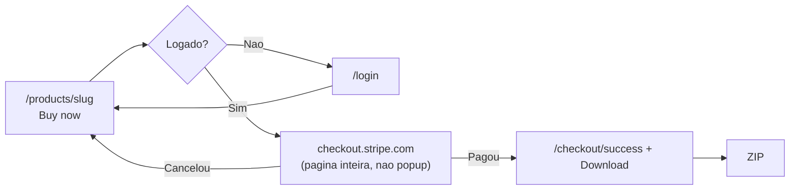

# 16. Pagamentos — arquitetura para agentes

Como a camada de pagamento está **montada no código**. Setup de conta Stripe, VAT e checklist de dashboard ficam em [13 — Stripe setup](./13-stripe-setup.md). Schema/RLS em [12 — Banco de dados](./12-database.md).

Público: boilerplate digital, **pagamento único** (não assinatura). Stripe Checkout hospedado. Fulfillment no webhook, com backup idempotente na página de sucesso.

---

## 0. O que o usuário *vê* (não é popup)

O Stripe **não abre modal nem popup**. O `BuyButton` faz `window.location.href = session.url` — a **aba inteira** vai para `checkout.stripe.com`. Depois do pagamento, o Stripe redireciona de volta para `couto.software`.

```
couto.software                    checkout.stripe.com                 couto.software
┌─────────────────┐               ┌─────────────────────┐            ┌──────────────────┐
│ /products/slug  │  redirect     │ Página do Stripe    │  redirect  │ /checkout/success│
│ [ Buy now ]  ───┼──────────────►│ cartão / SEPA / etc │───────────►│ [ Download ] ZIP │
└─────────────────┘               └─────────────────────┘            │ dashboard depois │
     ▲         se cancelar                                           └──────────────────┘
     └────────────────────────────────────────────────────────────────
```

Tela a tela:

| # | Onde | O que aparece |
|---|------|----------------|
| 1 | `/products/{slug}` | Página do boilerplate + **Buy now** |
| 2 | Sem login | `/login?redirect=/products/{slug}` — depois volta ao produto |
| 3 | Clique (logado) | Botão vira **Processing…**; a aba sai do site |
| 4 | **Stripe Checkout** (página cheia, branding CSH se configurado) | E-mail, método de pagamento, pagar |
| 5a | Cancelou | Volta para `/products/{slug}` (nada cobrado) |
| 5b | Pagou | Stripe manda para `/checkout/success?session_id=...` |
| 6 | `/checkout/success` | “Thank you…” + **Download** do ZIP (e link para o dashboard) |
| 7 | Clique Download | `GET /api/download/{id}` — o browser baixa o `.zip` |

Por trás do passo 5b: o webhook cria `order` + `entitlement`. A página de sucesso **confirma o pagamento no Stripe** (`sessions.retrieve`) e chama `fulfillCheckoutSession` de forma **idempotente** se o webhook ainda não chegou — assim o botão de download aparece na hora. A URL sozinha não basta: sem Session paga e `userId` igual ao logado, não há ZIP.



---

## 1. Contrato (não negociável)

1. **Stripe é a fonte de verdade de preço e cobrança.** Supabase guarda catálogo de marketing, pedido e direito de acesso.
2. **`mode: 'payment'`** — um Price one-time por produto. Sem `subscription`.
3. Todo produto comprável tem `stripe_price_id`. Sem esse campo o checkout **lança erro**.
4. O browser **nunca** marca pedido como pago só porque a URL tem `session_id`. Quem escreve `orders`/`entitlements` é o webhook **ou** o fulfill idempotente na success page **depois** de `stripe.checkout.sessions.retrieve` confirmar `paid` e o `userId` da metadata bater com o usuário logado.
5. Rotas HTTP são finas. Lógica em `src/server/services/` (recebem clients Stripe/Supabase como parâmetro).
6. Idempotência: `orders.stripe_checkout_session_id` é **unique**. Reprocessar o mesmo evento não duplica pedido.

---

## 2. Mapa de arquivos

```
src/
├── lib/stripe.ts                          # singleton Stripe (secret key)
├── lib/money.ts                           # formatPrice
├── app/api/checkout/route.ts              # POST — cria Session (login obrigatório)
├── app/api/stripe/webhook/route.ts        # POST — único escritor de compra
├── app/api/billing/portal/route.ts        # POST — Customer Portal
├── app/api/download/[productId]/route.ts  # GET — ZIP se tiver entitlement
├── app/checkout/success/page.tsx          # UI + download; fulfill idempotente após retrieve Stripe
├── app/checkout/cancel/page.tsx           # UI se o usuário abortar
├── app/products/[slug]/page.tsx           # BuyButton
├── app/dashboard/purchases/page.tsx       # lista orders
├── app/dashboard/billing/page.tsx         # abre portal
├── components/products/BuyButton.tsx
├── components/dashboard/BillingPortalButton.tsx
└── server/services/
    ├── checkout.ts                        # createCheckoutSession
    ├── billing.ts                         # Customer + Portal
    ├── orders.ts                          # fulfill, refund, sync catalog
    ├── entitlements.ts                    # quota de download
    ├── products.ts                        # catálogo published
    └── delivery.ts                        # ZIP + fingerprint
```

| Camada | O que faz | O que **não** faz |
|--------|-----------|-------------------|
| `BuyButton` | `POST /api/checkout` → redirect para `session.url` | Não grava order |
| `POST /api/checkout` | Auth + produto `published` + Customer + Session | Não espera o pagamento |
| Stripe Checkout | Cobra o cartão | — |
| `POST /api/stripe/webhook` | Verifica assinatura; chama services | Não confia em querystring do success |
| `/checkout/success` | Confirma Session no Stripe; fulfill idempotente; mostra **Download** | Não confia só na querystring |

---

## 3. Fluxo ponta a ponta

```
Usuário autenticado
    │  clica Buy now  (BuyButton)
    ▼
POST /api/checkout  { productId }
    │  getUser() — 401 se anônimo
    │  products.status = 'published' — 404 senão
    │  getOrCreateStripeCustomer → profiles.stripe_customer_id
    │  createCheckoutSession(mode: payment, metadata userId+productId)
    ▼
Redirect → Stripe Checkout hospedado
    │  paga  (ou aborta → /products/{slug}  /checkout/cancel)
    ▼
Stripe POST /api/stripe/webhook
    │  constructEvent(rawBody, stripe-signature, STRIPE_WEBHOOK_SECRET)
    │  checkout.session.completed
    │    ou checkout.session.async_payment_succeeded
    ▼
fulfillCheckoutSession(serviceClient, session, DOWNLOAD_LIMIT)
    │  só se payment_status paid | no_payment_required
    │  INSERT orders (status paid)  — unique session id
    │  UPSERT entitlements (user_id, product_id)
    │  UPDATE profiles.stripe_customer_id
    │  e-mail Zoho (falha de e-mail NÃO falha o fulfillment)
    ▼
Usuário em /checkout/success
    │  sessions.retrieve (pago + userId bate)
    │  fulfillCheckoutSession de novo se o webhook atrasou (idempotente)
    │  DownloadButton → GET /api/download/{productId}
    ▼
GET /api/download/{productId}
    │  entitlement + increment_download_count (RPC atômico)
    │  ZIP do bucket privado + log em downloads
    ▼
Refund total / dispute
    │  charge.refunded / charge.dispute.created
    ▼
handleRefund → orders.status = refunded; DELETE entitlement
```

Checkout **grátis** (`amount_total = 0` / `no_payment_required`) também fulfilla — o webhook trata os dois status.

---

## 4. Checkout Session (o que vai no Stripe)

`src/server/services/checkout.ts`:

| Campo | Valor |
|-------|--------|
| `mode` | `'payment'` |
| `line_items` | `[{ price: product.stripe_price_id, quantity: 1 }]` |
| `success_url` | `{APP_URL}/checkout/success?session_id={CHECKOUT_SESSION_ID}` |
| `cancel_url` | `{APP_URL}/products/{slug}` |
| `customer` **ou** `customer_email` | Customer existente, senão e-mail do user |
| `client_reference_id` | `userId` (fallback no fulfill) |
| `metadata` | `{ userId, productId }` — **obrigatório no fulfill** |
| `payment_intent_data.metadata` | mesmo par — usado em refund se o order não achar o PI |
| `billing_address_collection` | `required` — endereço na fatura e no cálculo de VAT |
| `tax_id_collection` | `{ enabled: true }` — VAT ID opcional (B2B reverse charge) |
| `automatic_tax` | `{ enabled: false }` — Stripe Tax ainda não existe para contas BR |
| `invoice_creation` | `{ enabled: true }` — fatura PDF pós-pagamento |

Dois e-mails depois do pagamento: **fatura Stripe** (comprovante/VAT) e **Zoho** (link do dashboard). Não misturar os papéis.

---

## 5. Webhook — eventos e handlers

Rota: `src/app/api/stripe/webhook/route.ts`  
`runtime = 'nodejs'`, `dynamic = 'force-dynamic'`. Body **raw** (`request.text()`), nunca `request.json()` — senão a assinatura quebra.

| Evento | Handler | Efeito |
|--------|---------|--------|
| `checkout.session.completed` | `fulfillCheckoutSession` | order + entitlement + e-mail |
| `checkout.session.async_payment_succeeded` | idem | métodos async (ex. SEPA) |
| `charge.refunded` | `handleRefund` | só **refund total** revoga acesso; parcial **preserva** entitlement |
| `charge.dispute.created` | `handleRefund(..., { skipPartialCheck: true })` | revoga mesmo sem valor estornado |
| `product.created` / `product.updated` | `syncStripeProduct` | cria `draft` ou atualiza nome/descrição/capa |
| `product.created` sem linha | insert `status: 'draft'` + slug único | **não publica sozinho** |
| `price.created` / `price.updated` | `syncStripePrice` | `price_cents`, `currency`, `stripe_price_id` |

Qualquer throw no handler → **HTTP 500** (Stripe retenta). Assinatura inválida / sem header → **400** (não retenta útil).

Eventos que **não** estão no `switch` são ignorados com `{ received: true }`.

---

## 6. Dados (o que cada tabela significa)

Detalhe de colunas/RLS: [12](./12-database.md).

| Tabela | Papel no pagamento |
|--------|--------------------|
| `profiles.stripe_customer_id` | Customer reutilizável (checkout + portal). Unique. |
| `products` | Catálogo. `status=published` é o único comprável. Vínculo `stripe_product_id` / `stripe_price_id`. |
| `orders` | Fato financeiro. `status`: `paid` → `refunded`. Unique em `stripe_checkout_session_id`. |
| `entitlements` | Direito de baixar. Unique `(user_id, product_id)`. `download_limit` (env `DOWNLOAD_LIMIT`, default 5) + `download_count`. |
| `downloads` | Auditoria (ip, user_agent). Não autoriza nada sozinha. |

**RLS:** o browser (anon) só **SELECT** orders/entitlements próprios. INSERT/UPDATE dessas tabelas = **somente** `createServiceClient()` no servidor.

Fulfill usa service role. Checkout de leitura do produto usa o client da sessão (RLS: published visível).

---

## 7. Billing portal

Não é assinatura. O portal existe para o Customer ver faturas / métodos no Stripe.

1. `POST /api/billing/portal` (login)
2. `getOrCreateStripeCustomer`
3. `stripe.billingPortal.sessions.create` → `return_url = /dashboard/billing`

Se `STRIPE_SECRET_KEY` faltar → **503**.

---

## 8. Download (pós-pagamento)

Não é Stripe. É a **consequência** do entitlement.

1. Auth; senão redirect `/login`
2. Rate limit `download:{userId}` (10 / 60s)
3. `getEntitlement` (RLS do user)
4. RPC `increment_download_count` — atômico; `false` = limite → 403
5. Lê `products.storage_path` (service role, bucket privado)
6. Se o ZIP falhar: `decrement_download_count` (rollback da cota)
7. Fingerprint no ZIP (`delivery.ts`) + insert `downloads`

Sem entitlement → **403**. Sem `storage_path` → **404** (e rollback da cota).

---

## 9. Env vars que esta camada exige

| Variável | Uso |
|----------|-----|
| `NEXT_PUBLIC_APP_URL` | success/cancel/portal/e-mail |
| `STRIPE_SECRET_KEY` | `getStripe()` |
| `STRIPE_WEBHOOK_SECRET` | `constructEvent` |
| `NEXT_PUBLIC_STRIPE_PUBLISHABLE_KEY` | presente no env; Checkout hospedado **não** monta Elements no client |
| `DOWNLOAD_LIMIT` | cota gravada no entitlement no fulfill (default 5) |
| `SUPABASE_SERVICE_ROLE_KEY` | webhook, download, customer upsert |
| `SUPABASE_PRODUCTS_BUCKET` | ZIP (default `products`) |

Fail-closed: `getStripe()` / `env.stripe.webhookSecret` **throw** se a env faltar (não há modo “skip payment” em produção).

---

## 10. Testes existentes

`src/server/services/orders.test.ts` cobre:

- fulfill no-op se a session já existe **e** já tem entitlement
- retry de entitlement se o order existe mas o entitlement não
- fulfill com `no_payment_required`
- skip se metadata falta ou `payment_status` ≠ paid
- throw se insert de order falha
- e-mail falho **não** derruba fulfill
- refund total → order refunded + entitlement apagado
- refund parcial → entitlement permanece
- dispute → revoga
- no-op se order já `refunded`

Ao mudar fulfill/refund/webhook, **estenda esses testes**. Não invente um segundo serviço paralelo.

---

## 11. Como um agente deve mexer nisso

**Pode**
- Ajustar metadata, URLs, tax flags **dentro** de `createCheckoutSession`
- Novo evento de webhook: ramo no `switch` + função em `orders.ts` (ou service irmão) + teste
- Portal / Customer: `billing.ts`

**Não pode**
- Chamar `fulfillCheckoutSession` no `BuyButton` ou só porque a URL tem `session_id`
- Criar order no `POST /api/checkout` “por antecipação”
- Usar `@supabase/ssr` no webhook (use `createServiceClient`)
- Publicar produto no `syncStripeProduct` (sempre `draft`)
- Tratar refund parcial como cancelamento de acesso (já é explícito no código)

A success page **pode** chamar `fulfillCheckoutSession` **depois** de `sessions.retrieve` confirmar pagamento e o `userId` da Session ser o usuário logado (backup idempotente se o webhook atrasar).

**Checklist antes de shipar pagamento**

- [ ] Webhook ainda valida assinatura no body raw
- [ ] Fulfill idempotente na `stripe_checkout_session_id`
- [ ] metadata `userId` + `productId` ainda chegam no Session **e** no PaymentIntent
- [ ] Falha de e-mail não impede entitlement
- [ ] `npm test` nos testes de `orders`
- [ ] Doc 13 atualizado se o contrato Stripe (eventos, tax, mode) mudar

---

## 12. Relação com os outros docs

| Precisa de | Doc |
|------------|-----|
| Chaves, Tax, Products no dashboard, CLI `stripe listen` | [13](./13-stripe-setup.md) |
| Tabelas, RLS, RPCs de cota | [12](./12-database.md) |
| Envs e bucket | [10](./10-marketplace-setup.md) |
| Rate limit / EULA / e-mail de compra | [11](./11-marketplace-hardening.md) |

---

## 13. Uma frase

> O client só pede uma Checkout Session; o Stripe cobra; o webhook cria `order` + `entitlement`; a página de sucesso confirma a Session na API do Stripe e, se o webhook atrasar, fulfilla de novo (idempotente) para já mostrar o **Download**.
