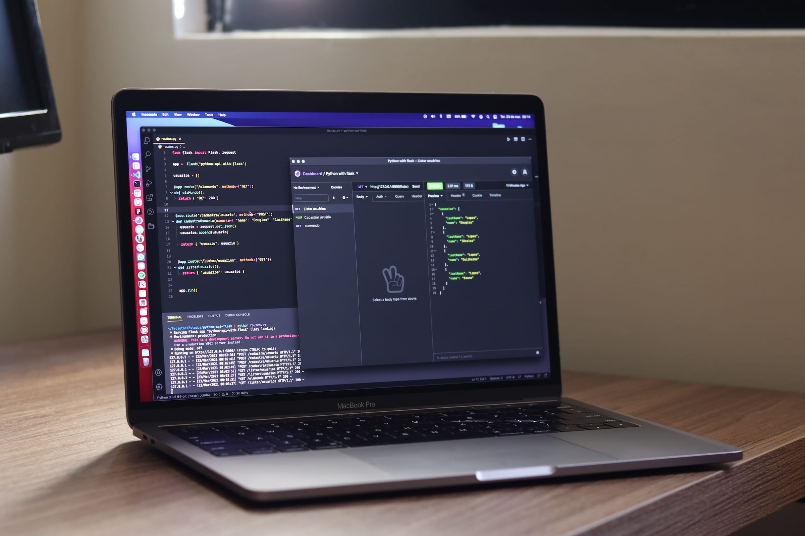

import imageLaptop from './laptop.jpg'
import imagePilot from './pilot.jpg'
import imageServer from './server.jpg'

export const article = {
  date: '2024-03-15',
  title: 'Why Web Performance Directly Impacts Your Revenue',
  description:
    'A one-second delay in page load can cost you 7% in conversions. Here is why performance is the most important investment you can make in your website.',
  author: {
    name: 'Tarcisio Couto',
    role: 'Founder, CSH',
  },
}

export const metadata = {
  title: article.title,
  description: article.description,
}

## Speed is not a feature — it is the product

When a user clicks a link to your website, a clock starts ticking. Research from Google shows that 53% of mobile users abandon a page that takes longer than 3 seconds to load. Every 100 milliseconds of additional delay reduces conversion rates by up to 7%.

This is not a theoretical problem. It is money leaving your business every single day.

## Core Web Vitals: what Google actually measures

Google ranks your website based on three key metrics that directly affect user experience:

**Largest Contentful Paint (LCP)** measures how long it takes for the main content of your page to appear. If your hero image or headline takes more than 2.5 seconds to render, Google considers that a poor experience.

**First Input Delay (FID)** measures how quickly your page responds to the first user interaction. A button that takes 300ms to react feels broken. Users do not wait — they leave.

**Cumulative Layout Shift (CLS)** measures visual stability. When elements jump around as the page loads — text shifts, images resize, buttons move — users lose trust in your site instantly.

## The compounding cost of a slow website

A slow website does not just lose one visitor. It loses that visitor, every referral they would have made, and every future visit they would have returned for. The damage compounds over time.

Consider this: if your site converts at 3% with a 2-second load time, improving to a 1-second load time could push that to 5% or higher. On 10,000 monthly visitors, that is 200 additional conversions per month — without spending a single dollar on advertising.

Search engines amplify this effect. Google prioritizes fast sites in search results, which means a slow site gets less organic traffic, which means fewer conversions, which means less revenue to invest in improvements. It is a downward spiral.

## How we solve this at CSH

Every project we deliver at Couto Software House is built with performance as a first-class requirement:

- **Server-Side Rendering (SSR)** with Next.js ensures your content is visible before JavaScript even loads
- **Static Generation (SSG)** pre-renders pages at build time so they load instantly from the CDN
- **Image optimization** with automatic WebP/AVIF conversion, lazy loading, and responsive sizing
- **Code splitting** ensures users only download the JavaScript they actually need for each page
- **Edge deployment** on Vercel puts your content physically closer to your users worldwide

The result: Lighthouse scores above 95, sub-second load times, and websites that convert visitors into customers.

## The bottom line

Performance is not a technical checkbox. It is the single highest-ROI investment you can make in your digital presence. Every millisecond you shave off your load time translates directly into more engagement, more conversions, and more revenue.

If your website takes more than 2 seconds to load, you are losing customers right now. The question is not whether you can afford to invest in performance — it is whether you can afford not to.
